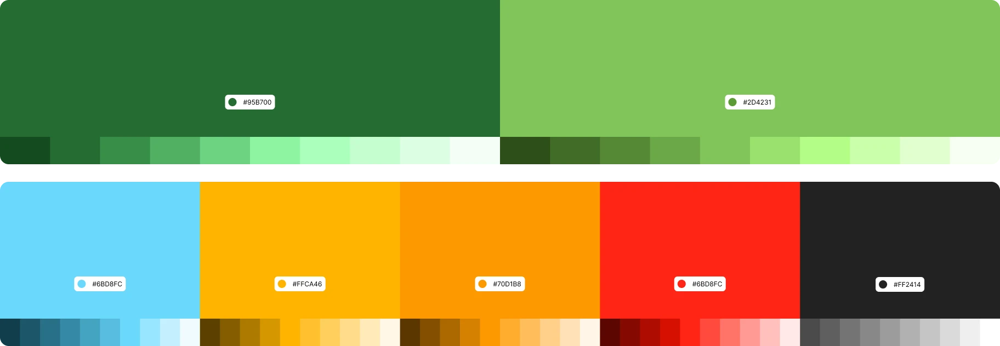

### Contexto 

Rediseño y reconstrucción de la web institucional sobre biodiversidad para mejorar usabilidad, accesibilidad y rendimiento móvil/desktop.

- **Rol:** Investigación de usuarios, arquitectura de la información, prototipado en Figma, creación de sistema de diseño y maquetación frontend.

- **Tecnologías:** Astro, Bootstrap, HTML5, CSS3, JavaScript, Git/GitHub, Lighthouse.

- **Resultados clave:** Mejora de rendimiento de 60 → 99 (desktop); LCP 4s → 0.7s; Speed Index 6.4s → 0.8s; accesibilidad y mejores prácticas alcanzaron 100 en desktop. Sitio optimizado para SEO y preparado para despliegue en Vercel/Netlify.

### Colores

### Enlaces

**Versión publicada:** 
- [zoodom.lat](https://zoodom.lat/).
- [Figma](https://www.figma.com/design/XMM37I0sKR6znHG1W0sxnw/ZOODOM?node-id=0-1&t=WxZEaVqm1xD6noRU-1).
- [Github](https://github.com/Iceheop/zoodom).
