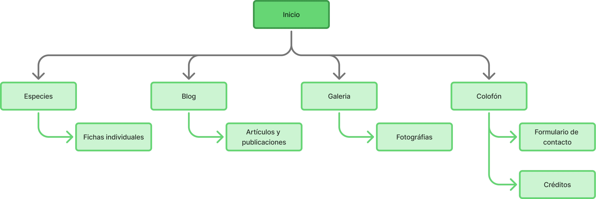

### Contexto 

El proyecto entregará un sitio web diseñado y desarrollado (Astro, HTML, CSS, JavaScript, Bootstrap) que sea responsivo, accesible (WCAG AA), optimizado para SEO básico y centrado en la experiencia del usuario. El rediseño busca resolver la baja frecuencia de visitas y la percepción de inconsistencia visual, priorizando fichas de especies y un calendario de eventos como contenidos clave para atraer visitas presenciales y mejorar la comunicación institucional.

La plataforma actual limita la comunicación institucional por problemas de diseño, arquitectura de información y accesibilidad; muchos usuarios no visitan o rara vez visitan la web (las respuestas más votadas fueron Nunca y Rara vez), y encuentran información con dificultad o solo “fácil” en algunos casos. Esto reduce la capacidad del ZOODOM para convertir interés en visitas y participación.

- **Rol:** Investigación de usuarios, arquitectura de la información, prototipado en Figma, creación de sistema de diseño y maquetación frontend.

- **Tecnologías:** Astro, Bootstrap, HTML5, CSS3, JavaScript, Git/GitHub, Lighthouse.

- **Resultados clave:** Mejora de rendimiento de 60 → 99 (desktop); LCP 4s → 0.7s; Speed Index 6.4s → 0.8s; accesibilidad y mejores prácticas alcanzaron 100 en desktop. Sitio optimizado para SEO y preparado para despliegue en Vercel/Netlify.

### Estructura del menú y secciones

### Colores

### Enlaces

**Versión publicada:** 
- [zoodom.lat](https://zoodom.lat/).
- [Figma](https://www.figma.com/design/XMM37I0sKR6znHG1W0sxnw/ZOODOM?node-id=0-1&t=WxZEaVqm1xD6noRU-1).
- [Github](https://github.com/Iceheop/zoodom).
